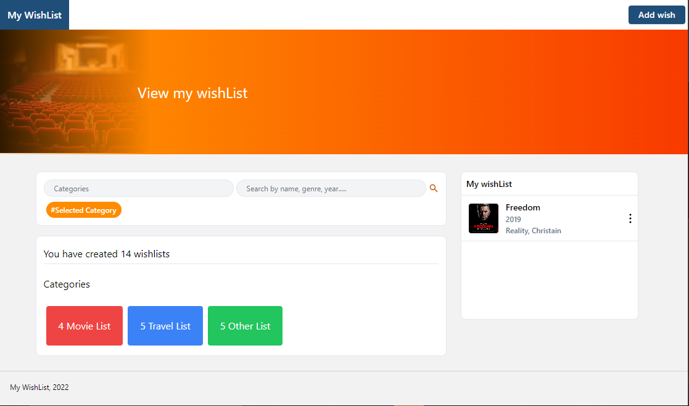

# My Wishlist



My wish list is a web application where a user can list down
his or her wish, expectations and goals for future purposes.
This is the front end section application.

## Create the presentation

After pulling code from github take the following steps:

First enter into the my-wishlist folder:

```bash
cd my-wishlist
```

Run the command to install the packages.

```bash
yarn install
```

Then run the command to start up the local server. 

```bash
yarn run dev
```

And boom. the application runs on your local server.


