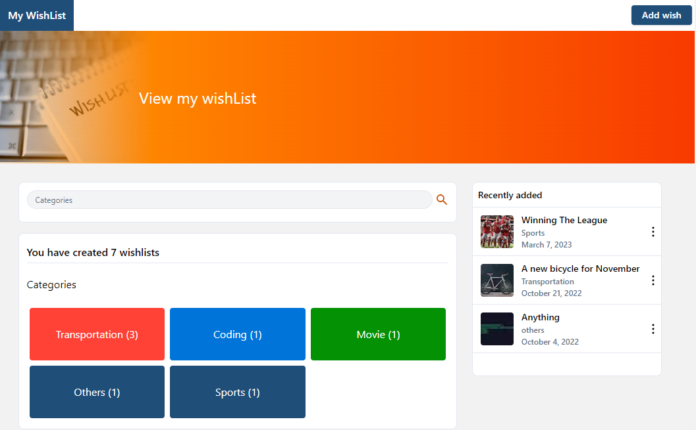

# My Wishlist



_The application is still been worked on so this is not the final view of the application_

My wish list is a web application where a user can list down
his or her wish, expectations and goals for future purposes.

## Create the presentation

After pulling code from github take the following steps:

First run the command to install the packages.

```bash
yarn install
```

Then run the command to start up the local server. 

```bash
yarn run dev
```

And boom. the application runs on your local server.

## Something to note about

At the moment, this project is not authenticated. So it's programmed for one user. There is still a high possibility of the project being authenticated in the future. 


